# Cloze (Hide All), CHA

[](https://www.buymeacoffee.com/trgk)

[](https://ankiweb.net/shared/info/1709973686)

This add-on creates a new card type. On this card type, all clozes except the one currently being reviewed now are hidden with yellow boxes.

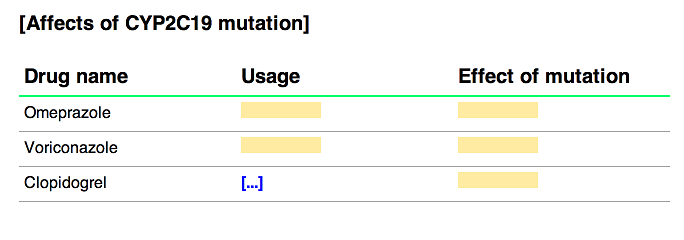

## Basic usage

You can apply CHA to cloze-type cards by adding a *CHA marker* to the note.

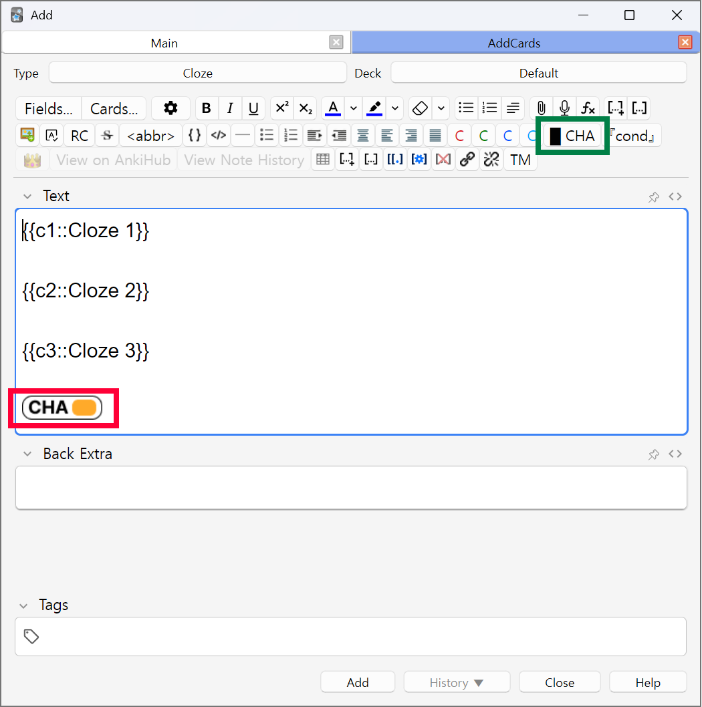

> Legacy method: You can use "Cloze (Hide All)" card type to automatically apply
> CHA to the card. Note that this is not the recommended method for new cards, and
> I won't maintain the card type further unless strictly required for compatibility.
> It's a little [technical debt](https://en.wikipedia.org/wiki/Technical_debt) right now.

When reviewing each cloze, other clozes will be hidden.

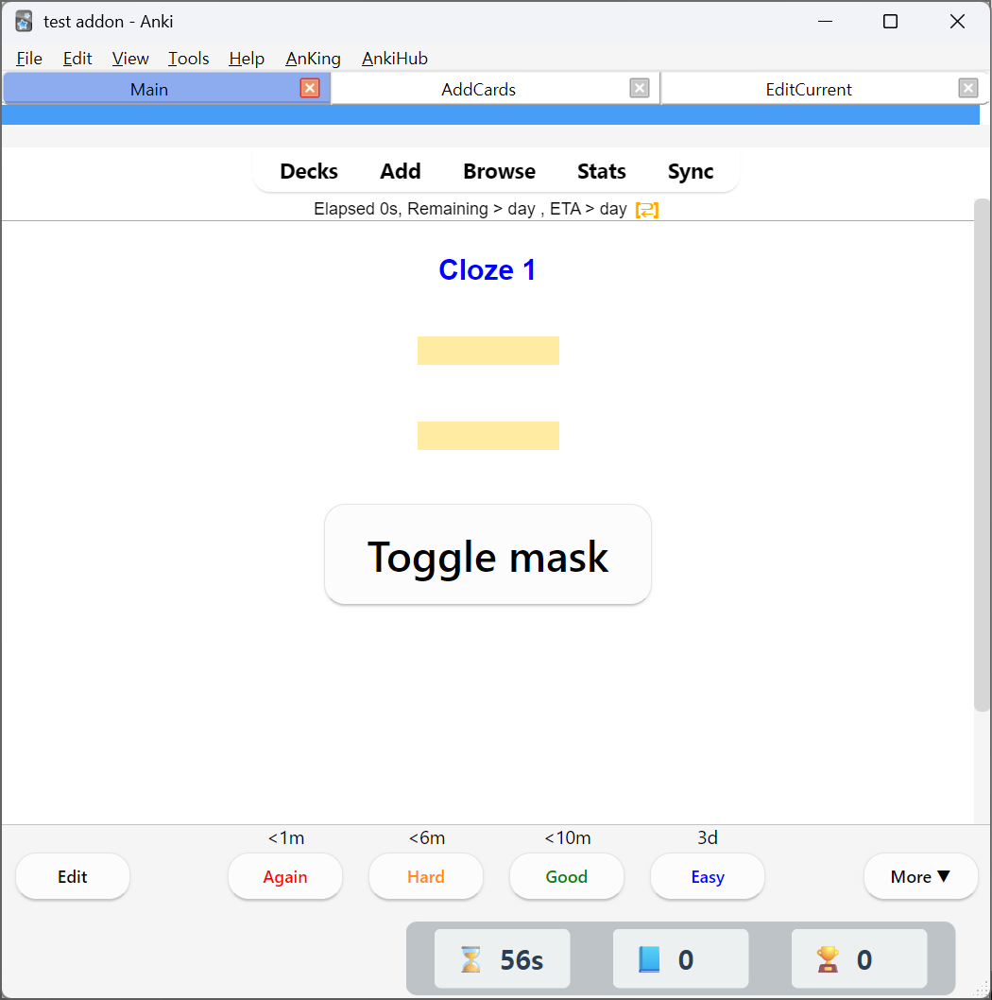

Wherever you put CHA marker, a "Toggle mask" button will appear. If you click that, all hidden clozes will be revealed.

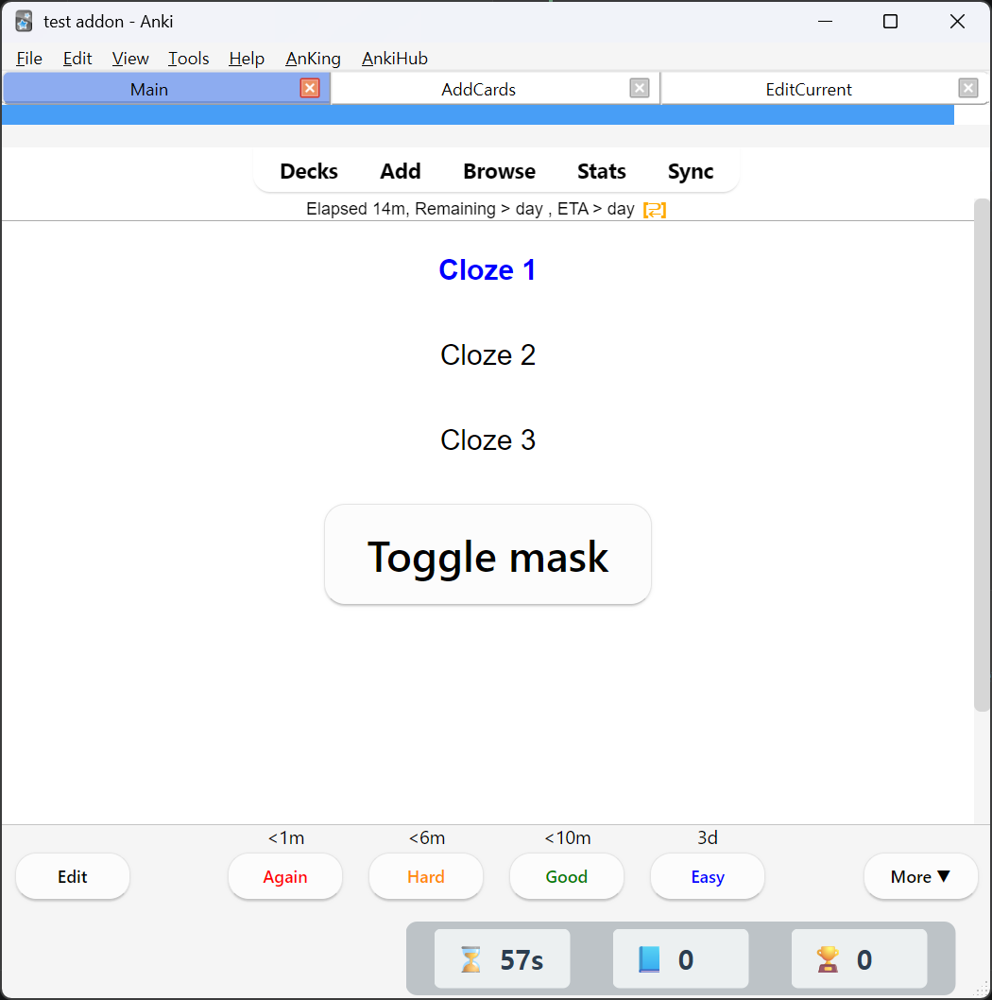

## Conditional reveal

Often, you'll want some clozes to always be visible. Let's look at this card for an example.

| Card | Preview |
| --- | ---- |
| 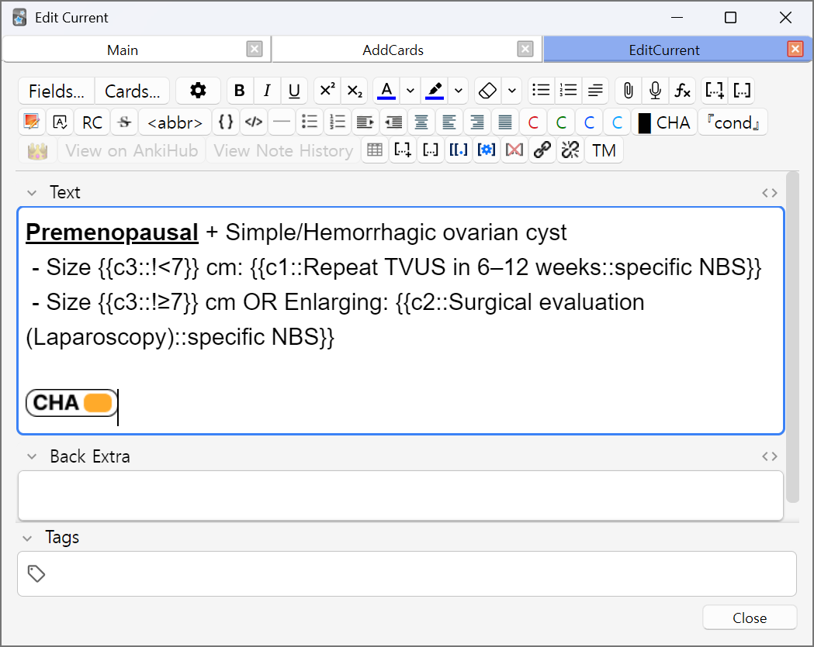 | 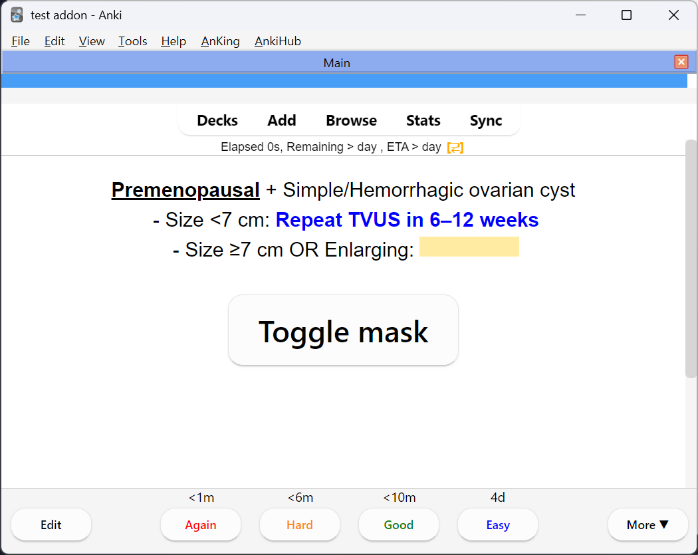 |

Here, `c3` is a cloze for cyst size, where `c1` and `c2` are treatments based on the cyst's size. So `c1` and `c2` require `c3` to be revealed on the review, while `c3` can independently be reviewed. Think of it like memorizing hierarchy.

So here, we prepend the content of `c3`s with `!`, which means that cloze will always be visible when reviewing any other cards. You can think of this as an 'unconditional' reveal.

```
Premenopausal + Simple/Hemorrhagic ovarian cyst
 - Size {{c3::!<7}} cm: {{c1::Repeat TVUS in 6–12 weeks::specific NBS}}
 - Size {{c3::!≥7}} cm OR Enlarging: {{c2::Surgical evaluation (Laparoscopy)::specific NBS}}
```

Conditional reveals mean you can only reveal clozes on specific conditions. Let's look at this complex card.

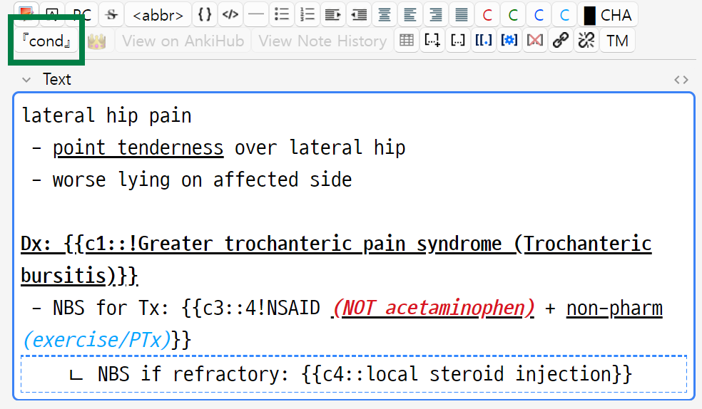

```
lateral hip pain
 - point tenderness over lateral hip
 - worse lying on affected side

Dx: {{c1::!Greater trochanteric pain syndrome (Trochanteric bursitis)}}
 - NBS for Tx: {{c3::4!NSAID (NOT acetaminophen) + non-pharm (exercise/PTx)}}

--------------------------------------------------------------
|   ㄴ NBS if refractory: {{c4::local steroid injection}}    |
--------------------------------------------------------------
```

- `{{c1::!` the content starts with `!`, which means that card (Greater trochanteric pain syndrome (Trochanteric bursitis)) will always be revealed.
- `{{c3::4!` the content starts with `4!`, which means that part will be revealed when reviewing `c4` cloze. So it will stay hidden when reviewing `c1`. *(there is no c2 in this card btw)*
- `c4` cloze inside a box. That box content will only be visible when any of the cloze within the box is being tested(reviewed). So user won't know if such box even exists when reviewing c1/c3. Only when reviewing c4 will the user know that such box exists.

> Note that the box content will be visible when you click the 'Toggle Mask' button.

So to summarize,

- Box: only visible when any of the cloze within it is being reviewed. It may also be revealed when using the `Toggle Mask` button you see on the back side of the card. You can put one with `[cond]` button in the toolbar.
- Cloze starting with `!`: always revealed. Never hidden.
- Cloze starting with `2!`, `1,3!`: will be revealed when reviewing `c2` and `c1`/`c3` respectively.

> There are other syntaxes like `<2!`, `<=3!`, `<>5!`, but the above examples will be sufficient for 99% of the cases.

With this system in mind, the above complex card is rendered like this.

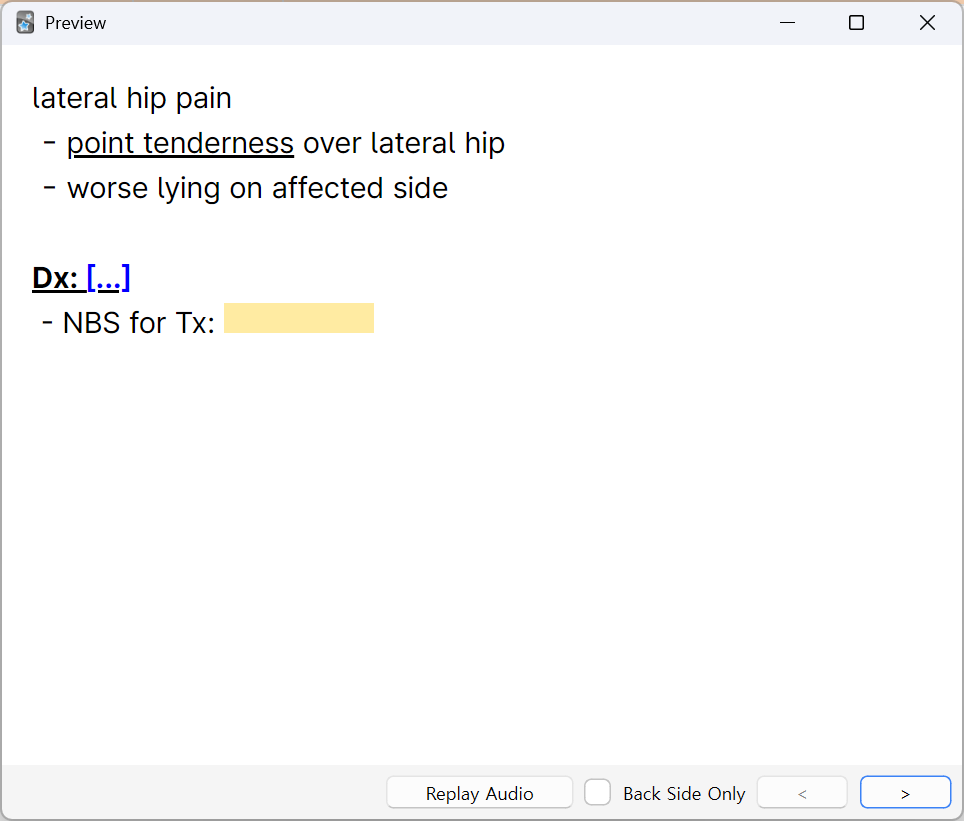 c1 card
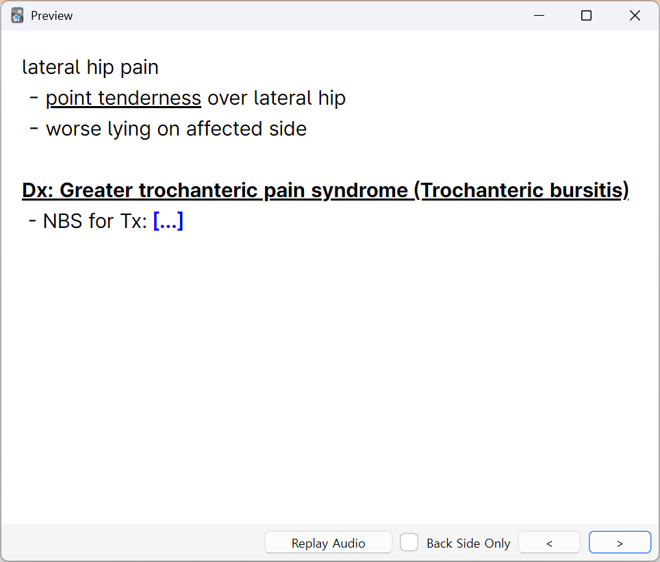 c3 card
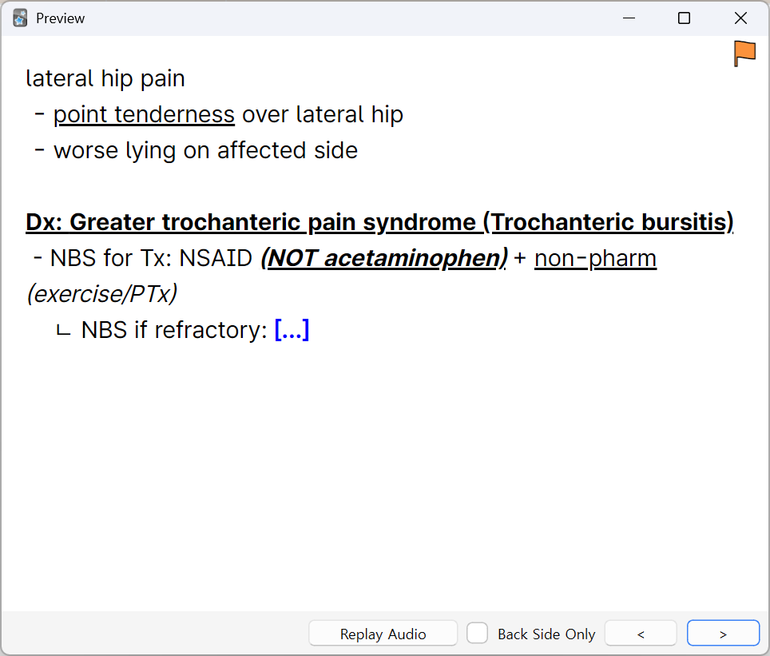 c4 card

You can use this to create a mini multi-cloze card like this.

## Example clozes

```
[Age-based understanding of death]

 - {{c1::!3}}-{{c1::!5}} yo: {{c2::death is temporary and reversible}}
 - {{c1::!5}}-{{c1::!7}} yo: {{c3::death is final, occurs to old/sick people → can be avoided by being careful}}
 - {{c1::!7}}-{{c1::!10}} yo: {{c4::death is universal and inevitable}}
 - {{c1::!10}}+ yo: {{c5::emotional understanding}}
```

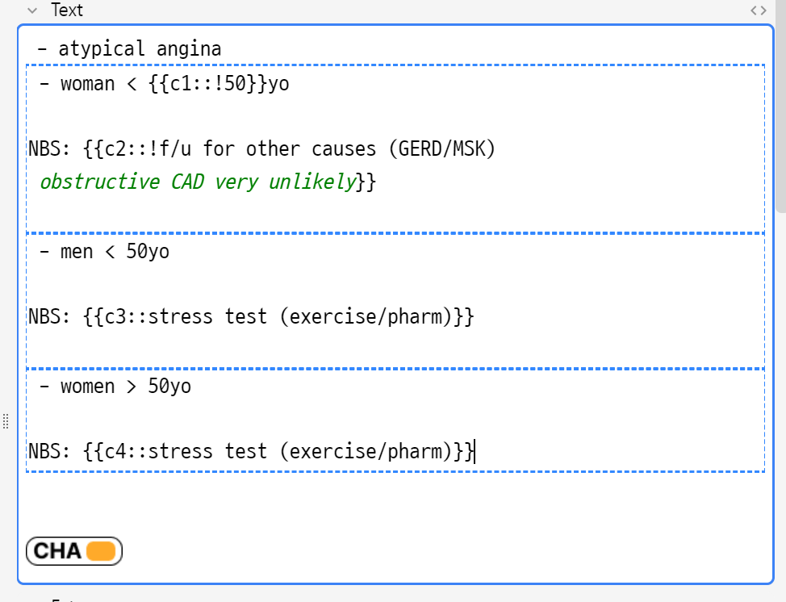
