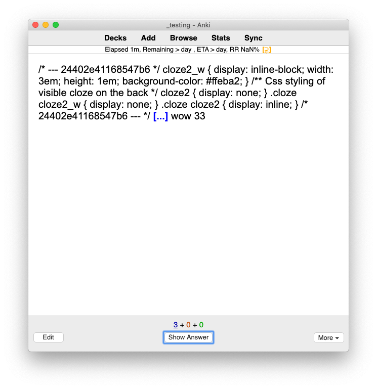
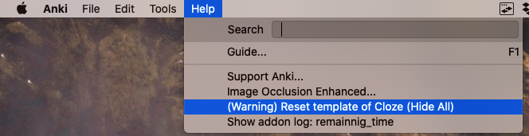
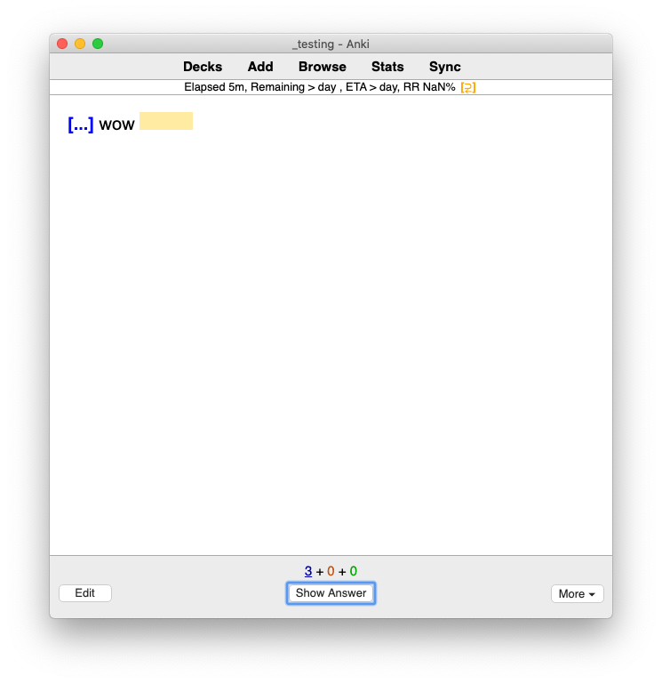

# Fixing bad template

Things could go wrong. Template could go rough.

Cloze (hide all) has a migration system to fix these buggy scripts, but it had been far from perfect. So we've added a **RESET** button. Fix for every bug is reboot, reset, format, etc...

1. On Anki menu, select *Help > (Warning) Reset template of Cloze (Hide All)*
   
2. Your changes to card template will reset. Things like custom font, background color, etc... will reset. Press `OK`.
   
3. The template will reset. All UI customization will be gone, but at least you have a new clean UI that you can start on.
   

This is the end of the guide.